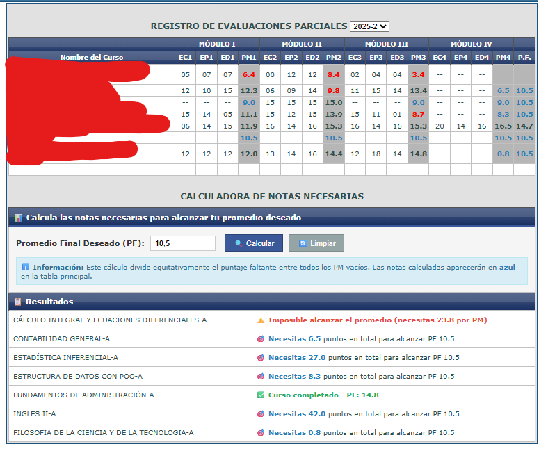

# 📊 Calculadora de Notas UNJFSC

Extensión que calcula automáticamente las notas necesarias para alcanzar tu promedio deseado en la Intranet UNJFSC.

## 🚀 Instalación

1. Descomprime el contenido descargado, tendrás una carpeta con el nombre `Calculadora de Notas`
2. Abre tu navegador y ve a `chrome://extensions/`
3. Activa el **Modo de desarrollador** (esquina superior derecha)
4. Click en **Cargar extensión sin empaquetar**
6. Selecciona la carpeta `Calculadora de Notas`.
7. ¡Listo! La extensión aparecerá en tu lista

## 📖 Uso

1. Ingresa a la Intranet UNJFSC: https://intranet.unjfsc.edu.pe/ZonaEstudiante/frmEvaluacionesParciales.aspx
2. La calculadora aparecerá automáticamente debajo de tu tabla de notas
3. Ingresa tu promedio deseado (por defecto: 10.5)
4. Las notas necesarias se calcularán automáticamente y aparecerán en **azul** en la tabla

